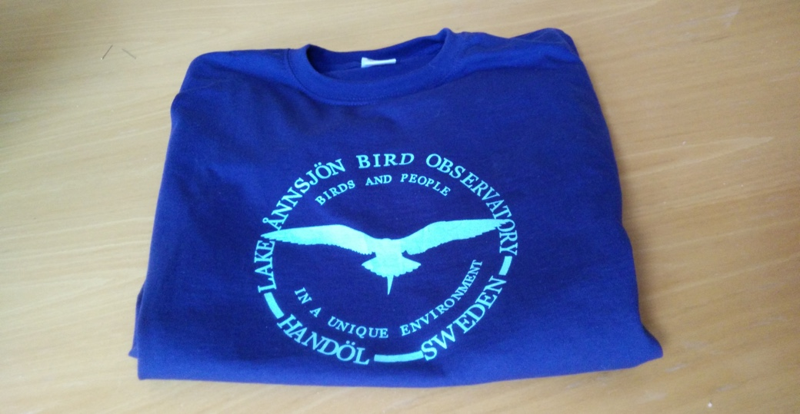

### Om föreningen

Ånnsjöns fågelstation är en ideell förening som arbetar för ökad kunskap om fågellivet i västra Jämtland. Vid Ånnsjön hittar man häckningsplatser för exklusiva fjällfåglar som dubbelbeckasin, fjällpipare och blåhake.

Sedan starten 1988 har många besökt fågelstationen i Handöl för att kombinera sitt fågelintresse med en semesterresa till en unik miljö. Vi är särskilt glada för att varje år locka många utländska besökare från stora delar av Europa.

Varje sommar inventerar vi förekomsten av sjöfåglar och vadare på myrar, våtmarker och fjällområden i regionen. I närheten av Handöl och i Enans delta ringmärker vi årligen 2000 - 4000 småfåglar.

Genom inventeringar och ringmärkning följer vi årligen ett sextiotal fågelarter. Vårt undersökningsområde ligger i kanten av fjällkedjan, och förändringar i utbredning hos många arter upptäcks lätt i denna gränszon. Våra insamlade data kan användas för att bättre förstå effekter av klimatförändringar, eller för specialstudier av enskilda arter.

Resultatet från arbetet presenteras årligen i ett specialnummer av Fåglar i Jämtland-Härjedalen samt fortlöpande här på hemsidan.

- - -

#### Köp vår T-shirt

<figure><figcaption>Våra t-shirts finns även i vinrött och antracit (mörkgrå).</figcaption></figure>

Stöd vårt arbete genom att köpa en t-shirt! Beställning görs genom en inbetalning till Pg 85 45 51 -9. Ange ditt namn, adress, önskad storlek och färg. Intäkterna från försäljningen går oavkortat till fågelstationens verksamhet.

**Medlemspris**: 150 kr (ord. 180 kr)
**Frakt & porto**: 50 kr/tröja
**Storlekar**: S – XXL

- - -

#### Medlemsavgift

Ett stort tack till alla som stödjer Ånnsjöns fågelstation ekonomiskt!

**Privatperson**: 150 kr
**Organisation**: 500 kr

Inbetalning sker på Plusgiro 85 45 51 -9
