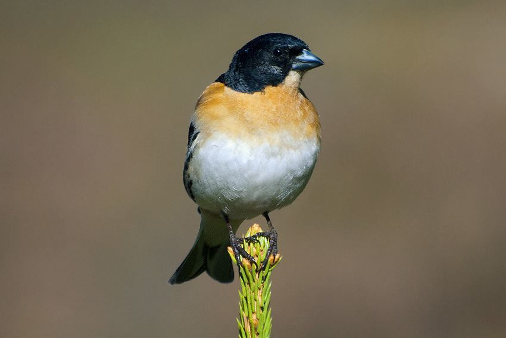

### Handöl

Handöl ligger strax väster om Ånnsjön och skiljs från sjön genom Enans och Handölans gemensamma deltaområde. Parkera vid Pensionat Handöl eller på fågelstationens parkering och gå cirka 50 meter till fågeltornet vid Lomtjärnsmyren.

Tornet syns inte från parkeringen. Tubkikare är bra att ha här. Fåglarna är ungefär desamma som i Ånn. Bara något trettiotal meter från fågeltornet ligger Ånnsjöns fågelstation, basen för de fortlöpande vetenskapliga undersökningarna av fågellivet i området. Här finns en informationslokal som är öppen när stationen är bemannad. Stationen är normalt bemannad från början av juni till slutet av augusti.

<figure><figcaption>Bergfink / Fringilla montifringilla.Foto:&nbsp;Steve&nbsp;Dahlfors</figcaption></figure>

Längs älven Handölans lopp genom Handöl sträcker sig ett lummigt, lövskogsdominerat område med ett rikt fågelliv. Bland annat häckar här trädgårdssångare, svarthätta, härmsångare och bergfink. Lundsångare har häckat minst en gång på 1990-talet och dvärgsparv har hörts. Mindre hackspett ses regelbundet. Under juli och augusti bedriver fågelstationen ringmärkning i området.

Ånnsjön och de yttre delarna av deltat är svåra att nå från Handöl om man inte har båt. För fågelskådaren spelar det mindre roll då fågellivet inte skiljer sig nämnvärt från det man kan se i Ånn. En fin utsikt över deltat och sjön har man från vägen mellan Handöl och Bunnerviken, just där den utgår från täljstensfabriken.