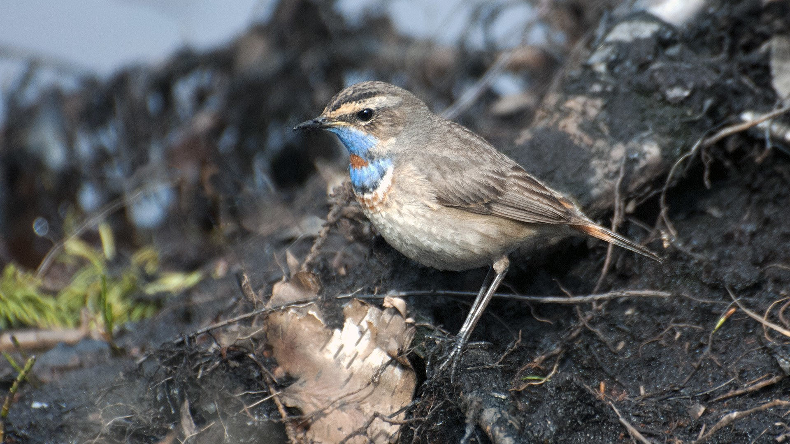

### Storulvån

Om man vill upp på fjället är Storulvån och vägen mot Storulvån en lämplig utgångspunkt. Närmast Storulvån ligger Getryggen som är lätt att nå även om den branta stigningen kan vara kännbar. Ripor av bägge arterna, blåhake och på högre höjd fjällpipare och snösparv hör till de fåglar man kan få syn på. Både kungsörn och jaktfalk ses ibland vid Storulvån, men fjällvråk och stenfalk är betydligt vanligare.

<figure><figcaption>Blåhake / Luscinia svecica.Foto:&nbsp;Steve&nbsp;Dahlfors</figcaption></figure>

En lite längre men lättsammare promenad är att gå till i Ulvåtjärn ca 6 km från Storulvån efter leden mot Blåhammaren. Vid Ulvåtjärn ses regelbundet fjällabb och sluttningen upp mot Storulvåfjället strax söder om Ulvåtjärn brukar vara en säker lappsparvlokal. Slutligen är Storulvån också en lämplig utgångspunkt om man ska gå till Bunnersjöarna en dryg halvmil österut. Efter att man passerat bron över Handölan går det brant uppåt och man går lämpligen norr om fjället Mettjeburretjahke för att komma upp på Bunnerplatån. I Bunnersjöarna brukar ligga några alfåglar och bergänder, söder om sjöarna kan man se lappsparv. Fjällpipare, fjällripa och någon gång skärsnäppa ses på de högre nivåerna runt sjöarna.

Lämplig tidpunkt för en fjällvandring beror mycket på snö- och isförhållanden. Ibland går inte isen på Bunnersjöarna upp förrän kring midsommar. På grund av rådande vindförhållanden (som påverkar snödjupet) blir fjällsluttningarna som vetter mot väster oftast snöfria ett par veckor före östsidan.