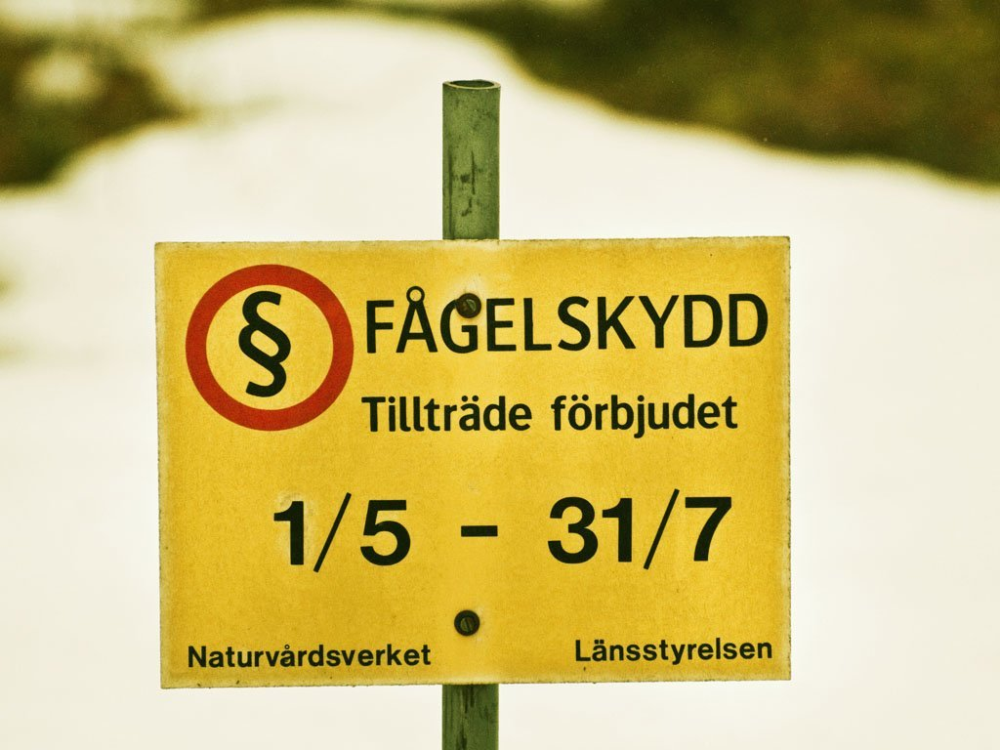

### Fågelskydd

**Kalfjällets mycket speciella karaktär gör att bara ett fåtal starkt specialiserade arter klarar att leva och föröka sig här. Även i de fjällnära löv- och barrskogarna råder tidvis kärva förhållanden och många skogslevande fågelarter befinner sig här på gränsen av sitt utbredningsområde. Fåglarna lever här både bokstavligt och bildligt på marginalen och även små förändringar i livsbetingelserna kan få avsevärda konsekvenser.**

Ånnsjön är sedan 1974 ett Ramsarområde vilket innebär att här finns, ur internationellt perspektiv, ett skyddsvärt våtmarksområde. Sverige har genom att underteckna [Ramsarkonventionen][1] förbundit sig att skydda och bevara fågellivet i området. Ånnsjön-Storlien är dessutom ett av ca 70 IBA-områden i Sverige. IBA står för Important Bird Area, ungefär "Viktigt fågelområde", och är ett internationellt projekt som drivs av [Birdlife&nbsp;International][2].

<figure><figcaption>Foto: Steve Dahlfors</figcaption></figure>

Att Ånnsjön finns upptagen i dessa två projekt visar hur värdefullt området är, inte bara lokalt utan också internationellt. Ånnsjöns fågelstations program för miljöövervakning innebär att vi årligen följer förekomsten hos för närvarande närmare sextio fågelarter som häckar i området. Det gör vi genom återkommande, standardiserade inventeringar, i myr- och fjällmiljöer samt fångst och ringmärkning av småfåglar i lövskogs- och buskområden runt Handöl, strax väster om Ånnsjön.

Grunden för miljöskyddet utgörs av ett väl fungerande system för att följa populationsförändringar hos djur och växter. Efter drygt tjugo års undersökningar har vi börjat få den grund som är nödvändig för att vi ska kunna upptäcka och följa långsiktiga förändringar i fågelfaunan. Kortsiktiga förändringar under något eller några år är vanliga och beror oftast på vädret. Däremot kan långsiktiga förändringar bero på miljöförändringar som utdikning av våtmarker, högt betestryck, igenväxning av åkermark och förändrat skogsbruk. Andra orsaker kan vara kvicksilverförgiftning, försurning eller förändrat jakttryck. Orsakerna kan finnas i häcknings- området, övervintringsområdet eller på viktiga rastplatser längs med flyttvägarna.

Av de 58 fågelarter som vi någorlunda kan följa visar hälften (29 st) inga påtagliga förändringar. Dit hör exempelvis lommarna, de flesta änder, måsar, mesar, bergfink och sävsparv. Ökat har kanadagås, trana, myrsnäppa, gluttsnäppa, blåhake och gråsiska. Minskat har fler (22 st), bl.a. ljungpipare, tofsvipa, enkelbeckasin, brushane, trädgårdssångare, svartvit flugsnappare och ytterligare några långflyttande, insektsberoende tättingar.

Orsakerna är sällan uppenbara och observerade förändringar måste analyseras och verifieras med kompletterande undersökningar. När det gäller de insektsberoende tättingarna tror vi att orsaken är att temperaturen under maj var betydligt lägre i slutet av 90-talet än den var i början.

#### Relaterade länkar
- [IBA sammanfattning](/file/iba/iba-sammanfattning.pdf) (pdf)
- [Ramsar om Ånnsjön](https://rsis.ramsar.org/ris/26)
- [Fågelskydd (SOF)](http://www.sofnet.org/sveriges-ornitologiska-forening/fagelskydd/)

[1]: <http://ramsar.org>
[2]: <http://birdlife.org>