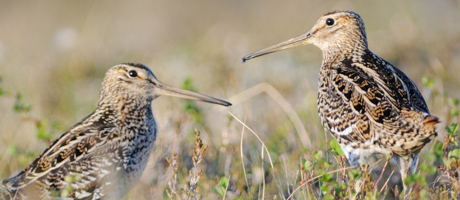
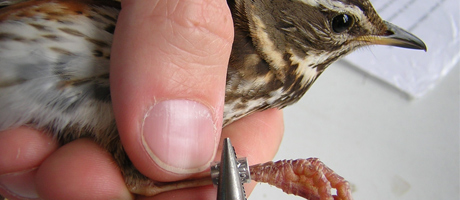
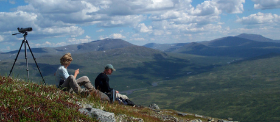

### Projekt

Utöver nedanstående standardprojekt genomför vi även holkprojekt om tillgången på personal är god.

- - -

#### Dubbelbeckasinprojektet

<figure><figcaption>Foto: Björn Isaksson</figcaption></figure>

Beståndet av dubbelbeckasin är en av de viktigaste anledningarna till att Ånnsjön- Storlien finns med på BirdLife International's lista över Important Bird Areas (IBA). Sedan 2004 har vi tillsammans med forskare från Lund bedrivit inventering, radiopejling och nätfångst samt märkning med ljusloggers.

    <a href="#projects/great-snipe" class="button">Till projektsidan</a>

- - -

#### Ringmärkning av tättingar

<figure><figcaption>Foto: Mikael Carlsson</figcaption></figure>

Sedan starten 1988 har vi bedrivit standardiserad ringmärkning av tättingar i Handöl och Enans delta i Ånnsjön. Syftet är att följa populations- förändringar för ett stort antal arter, och framför allt ger projektet ett bra mått på häckningsframgången för tex lövsångare, blåhake, gulärla, bergfink och sävsparv.

- - -

#### Fjällrutter

<figure><figcaption>Foto: Malte Busch</figcaption></figure>

Femton fjällrutter i området Ånnsjön-Storlien inventeras årligen med linjetaxerings&shy;metodik. Syftet är att följa populationsutvecklingen hos fågelarter inom videbältet och kalfjällsregionen, i första hand arter med sin utbredning begränsad till denna region, tex alfågel, fjällpipare, skärsnäppa, kärrsnäppa, fjällabb, fjällripa, dalripa, fjällvråk, korp, stenskvätta, snösparv, lappsparv, och ringtrast. Att inventera fjällrutter är mycket enkelt, bara man kan läsa kartan!

- [Ruttkartor][fjr1] (pdf)
- [Metodbeskrivning][fjr2] (pdf)

[fjr1]: </file/projects/fjallrutter-kartor.pdf>
[fjr2]: </file/projects/fjallrutter-metodbeskrivning.pdf>

- - -

#### Kvadratrutan

Kvadratrutan är en halvkvantitativ fågelinventering av ett kvadratiskt område med storleken 1x1 km. Inventeringsrutorna överensstämmer med "Rikets nät", det svarta rutnät som finns inlagt på de flesta topografiska kartor. Med halvkvantitativ menas att det i huvudsak är artförekomsten som ska noteras, antalet individer noteras bara i begränsad omfattning.

- [Projektbeskrivning][kvn1] (pdf)
- [Inventeringsområdet][kvn2] (pdf)

[kvn1]: </file/projects/kvadratrutan-beskrivning.pdf>
[kvn2]: </file/projects/kvadratrutan-omradet.pdf>

- - -

#### Myrinventering

Ett dussintal myrar och våtmarker runt Ånnsjön och Storlien har inventerats varje sommar sedan 1989. Alla vadare, änder, måsar och andra våtmarksfåglar samt vissa tättingar noteras. Grönbena, småspov och silvertärna är vanliga arter på myrarna, och man har goda chanser att hitta myrsnäppor på de blötaste partierna.

- - -

#### Sjöinventering

Ånnsjön inventeras från båt vid ett eller flera tillfällen för att notera t.ex. lommar, sjöorrar, svärtor, alfåglar och andra sjöfåglar som häckar i sjön eller rastar på sin väg upp mot ännu frusna fjällsjöar. Ett lagarbete för tre personer där en kör båten, en spanar och identifierar och en antecknar.
